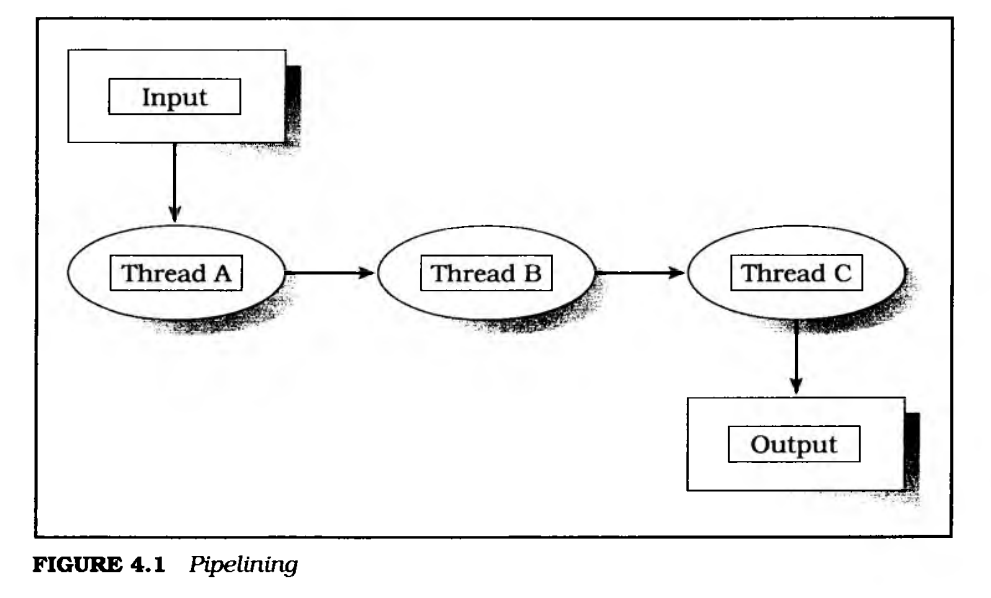

基于C++标准库实现流水线模式
===========================

本文将介绍一个C++实现的流水线模式，包括相关的接口和类框架：

首先，我们给出流水线模式的定义，这里引用《Programming with POSIX® Threads》（David R. Butenhof）里
的原话给出解释：

> Pipeline
>
> In pipelining, a stream of “data items” is processed serially by an ordered set
> of threads (Figure 4.1). Each thread performs a specific operation on each item in
> sequence, passing the data on to the next thread in the pipeline.
>
> For example, the data might be a scanned image, and thread A might process
> an image array, thread B might search the processed data for a specific set of features, and thread C might collect the serial stream of search results from thread B
> into a report. Or each thread might perform a single step in some sequence of
> modifications on the data.

      

