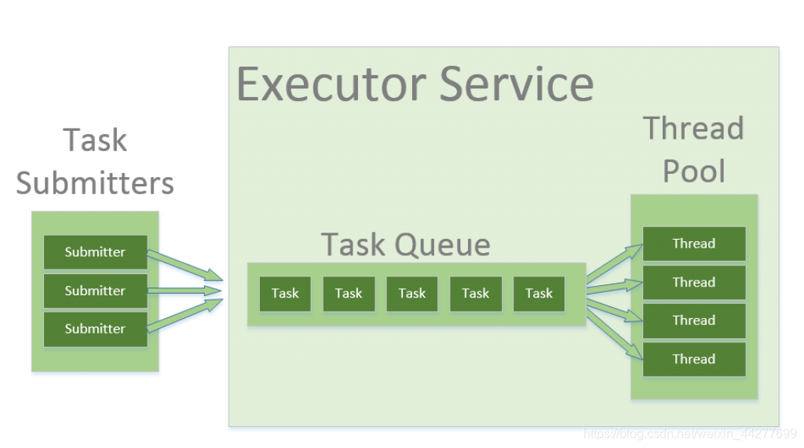

基于C++标准库实现线程池thread_pool类
====================================

线程池类是多线程编程中经常设计到的工具类，
许多编程语言都内置了类似的类库，比如python里的ThreadPoolExecutor（在concurrent.futures 模块中）
今天我就来介绍一下，如何基于C++标准库实现一个简单的线程池类。

我们先给出线程池里的基本数据结构和类对象的角色。如下图：



这张图大概的意思就是，一个线程池大概由三部分组成：
- Task类
- 一个可以存放Task对象的FIFO的线程安全的队列--TaskQueue
- 一组可以从TaskQueue中取任务，去异步执行任务的线程组

接下来我们就开始介绍C++里的线程池的实现，并且从最简单版本入手，
逐步扩充完善，最终给出一个在实际项目中可用的简单线程池。

首先给出第一版线程池的接口和说明：

```cpp
class thread_pool
{
public:
    thread_pool(unsigned const thread_count=std::thread::hardware_concurrency());
    ~thread_pool();

    template<typename FunctionType>
    void submit(FunctionType f);
};
```

这个thread_pool类接口就一个：submit，用来提交任务，具体的，
调度可调用对象 f，以 f() 方式执行。
而且在第一个版本里，是没有办法来等待一个任务完成。

我们给出调用thread_pool::submit接口的示例代码，让大家有个直观的认识：

```cpp
#include <iostream>
#include <chrono>
#include <functional>
#include <thread>
#include "thread_pool.hpp"

void spider(int page) {
    std::this_thread::sleep_for(std::chrono::seconds(page));
    std::cout << "crawl task" << page << " finished" << std::endl;
}


int main() {
    thread_pool t{5};

    t.submit(std::bind(spider, 1));
    t.submit(std::bind(spider, 2));
    t.submit(std::bind(spider, 3));

    char c;
    std::cin >> c;
    return 0;
}
```

为了方便对比，我同时给出Python里的ThreadPoolExecutor的等价代码：

```py
from concurrent.futures import ThreadPoolExecutor
import time


def spider(page):
    time.sleep(page)
    print(f"crawl task{page} finished")

with ThreadPoolExecutor(max_workers=5) as t:  # 创建一个最大容纳数量为5的线程池
    t.submit(spider, 1)
    t.submit(spider, 2)  # 通过submit提交执行的函数到线程池中
    t.submit(spider, 3)
```

接下来，我们给出thread_pool的完整实现，并且给出代码讲解：

```
#pragma once

#include <thread>
#include <vector>
#include <atomic>
#include "threadsafe_queue.hpp"

class join_threads
{
    std::vector<std::thread>& threads;

public:
    explicit join_threads(std::vector<std::thread>& threads_):
        threads(threads_)
    {}

    ~join_threads()
    {
        for(unsigned long i=0;i<threads.size();++i)
        {
            if(threads[i].joinable())
                threads[i].join();
        }
    }
};

class thread_pool
{
    std::atomic_bool done;
    threadsafe_queue<std::function<void()>> work_queue;     // 1
    std::vector<std::thread> threads;       // 2
    join_threads joiner;        // 3

    void worker_thread()
    {
        while(!done)            // 4
        {
            std::function<void()> task;
            if(work_queue.try_pop(task))        // 5
            {
                task();         // 6
            }
            else
            {
                std::this_thread::yield();  // 7
            }
        }
    }

public:
    thread_pool(unsigned const thread_count=std::thread::hardware_concurrency()):   // 8
        done(false),joiner(threads)
    {
        try
        {
            for(unsigned i=0;i<thread_count;++i)
            {
                threads.push_back(
                    std::thread(&thread_pool::worker_thread,this));     // 9
            }
        }
        catch(...)
        {
            done=true;      // 10
            throw;
        }
    }

    ~thread_pool()
    {
        done=true;          // 11
    }

    template<typename FunctionType>
    void submit(FunctionType f)
    {
        work_queue.push(std::function<void()>(f));  // 12
    }
};
```

这段代码的出处来自《C++ 并发编程实战（第二版）》的第9.1节线程池，这里摘抄书中关键部分：
实现中有一组工作线程（注释2），并且使用线程安全队列（注释1）来管理任务队列。
这种情况下，用户不用等待任务，并且任务不需要返回任何值，所以可以使用 std::function<void()> 对任务进行封装。
submit()会将函数或可调用对象包装成一个 std::function<void()> 实例，将其推入队列中（注释12）。

线程始于构造函数：这些线程会在worker_thread()成员函数中执行（注释9）

worker_thread函数很简单：从任务队列上获取任务（注释5），以及同时执行这些任务（注释6），执行一个循环直到设置
done标志（注释4）。如果任务队列上没有任务，函数会调用 std::this_thread::yield() 让线程休息（注释7），并且给予其他
线程向任务队列推送任务的机会。

这样简单的线程池就完成了，特别是任务没有返回值，或需要执行阻塞操作的任务。[完整的工程代码](https://github.com/hexu1985/Collection.Of.Cpp.Utility.Tools/tree/master/code/thread_pool/recipe-01)

这个简单的线程池还有一个问题，如果任务队列上没有任务，虽然函数会调用 std::this_thread::yield() 让线程休息，
但系统空闲时，线程池还是类似于忙等的循环。我们可以通过把work_thread里的try_pop改成wait_and_pop，去除忙等的情况，
但是又会引入一个新的问题，当work_thread在wait_and_pop上挂起时，如果没有新任务加入到任务队列，那工作线程永远不会被唤醒，
所以修改版本的线程池，除了将done置为true，还得向任务队列里塞入足够（线程池中工作线程的个数）的空任务，来唤醒挂起的工作线程。

具体的修改如下图：


代码修改就两点：
- work_thread中while循环中try_pop+yield替换成wai_and_pop
- 增加stop接口来替代简单的将done置为true


