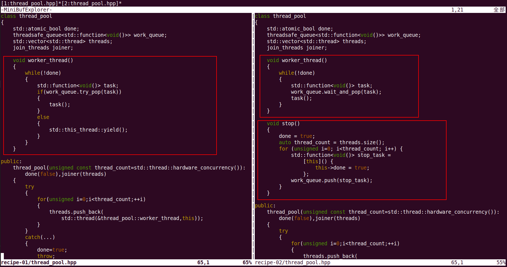
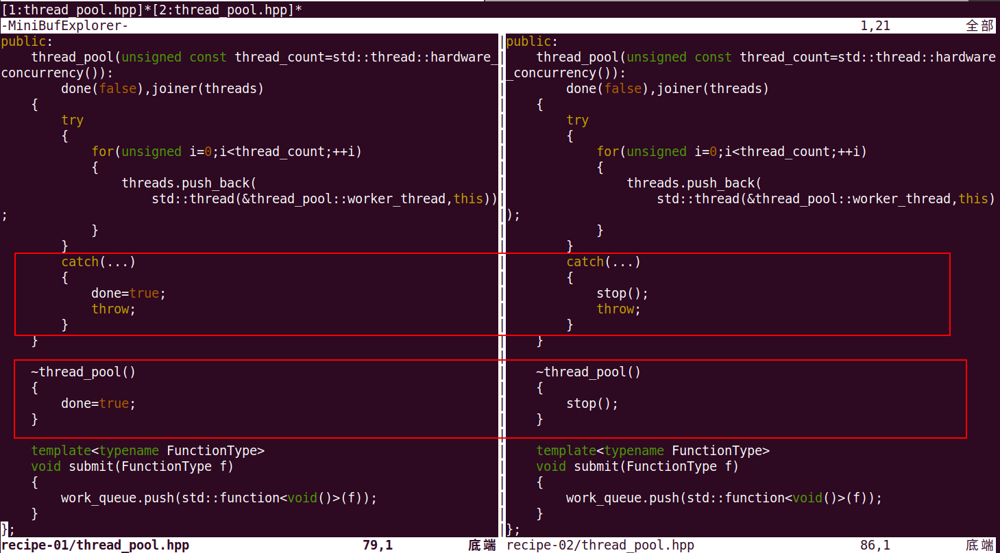
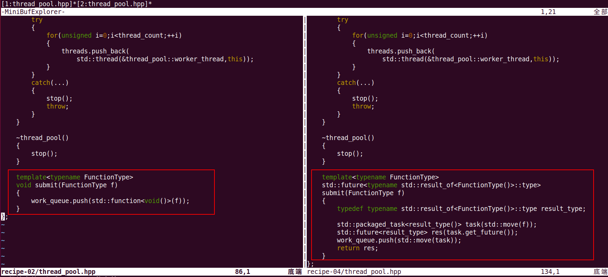
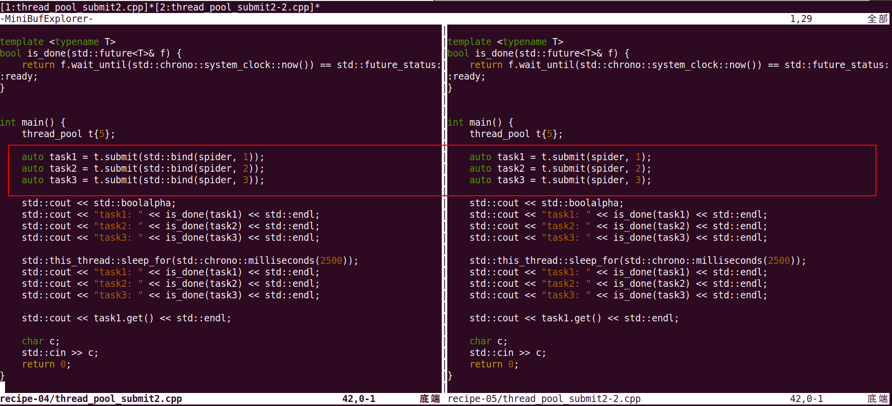

基于C++标准库实现线程池thread_pool类
====================================

线程池类是多线程编程中经常设计到的工具类，
许多编程语言都内置了类似的类库，比如python里的ThreadPoolExecutor（在concurrent.futures 模块中）
今天我就来介绍一下，如何基于C++标准库实现一个简单的线程池类。

我们先给出线程池里的基本数据结构和类对象的角色。如下图：


这张图大概的意思就是，一个线程池大概由三部分组成：
- Task类
- 一个可以存放Task对象的FIFO的线程安全的队列--TaskQueue
- 一组可以从TaskQueue中取任务，去异步执行任务的线程组

接下来我们就开始介绍C++里的线程池的实现，并且从最简单版本入手，
逐步扩充完善，最终给出一个在实际项目中可用的简单线程池。

**STEP1**

首先给出第一版线程池的接口和说明：

```cpp
class thread_pool
{
public:
    thread_pool(unsigned const thread_count=std::thread::hardware_concurrency());
    ~thread_pool();

    template<typename FunctionType>
    void submit(FunctionType f);
};
```

这个thread_pool类接口就一个：submit，用来提交任务，具体的，
调度可调用对象 f，以 f() 方式执行。
而且在第一个版本里，是没有办法来等待一个任务完成。

我们给出调用thread_pool::submit接口的示例代码，让大家有个直观的认识：

```cpp
#include <iostream>
#include <chrono>
#include <functional>
#include <thread>
#include "thread_pool.hpp"

void spider(int page) {
    std::this_thread::sleep_for(std::chrono::seconds(page));
    std::cout << "crawl task" << page << " finished" << std::endl;
}


int main() {
    thread_pool t{5};

    t.submit(std::bind(spider, 1));
    t.submit(std::bind(spider, 2));
    t.submit(std::bind(spider, 3));

    char c;
    std::cin >> c;
    return 0;
}
```

为了方便对比，我同时给出Python里的ThreadPoolExecutor的等价代码：

```py
from concurrent.futures import ThreadPoolExecutor
import time


def spider(page):
    time.sleep(page)
    print(f"crawl task{page} finished")

with ThreadPoolExecutor(max_workers=5) as t:  # 创建一个最大容纳数量为5的线程池
    t.submit(spider, 1)
    t.submit(spider, 2)  # 通过submit提交执行的函数到线程池中
    t.submit(spider, 3)
```

接下来，我们给出thread_pool的完整实现，并且给出代码讲解：

```
#pragma once

#include <thread>
#include <vector>
#include <atomic>
#include "threadsafe_queue.hpp"

class join_threads
{
    std::vector<std::thread>& threads;

public:
    explicit join_threads(std::vector<std::thread>& threads_):
        threads(threads_)
    {}

    ~join_threads()
    {
        for(unsigned long i=0;i<threads.size();++i)
        {
            if(threads[i].joinable())
                threads[i].join();
        }
    }
};

class thread_pool
{
    std::atomic_bool done;
    threadsafe_queue<std::function<void()>> work_queue;     // 1
    std::vector<std::thread> threads;       // 2
    join_threads joiner;        // 3

    void worker_thread()
    {
        while(!done)            // 4
        {
            std::function<void()> task;
            if(work_queue.try_pop(task))        // 5
            {
                task();         // 6
            }
            else
            {
                std::this_thread::yield();  // 7
            }
        }
    }

public:
    thread_pool(unsigned const thread_count=std::thread::hardware_concurrency()):   // 8
        done(false),joiner(threads)
    {
        try
        {
            for(unsigned i=0;i<thread_count;++i)
            {
                threads.push_back(
                    std::thread(&thread_pool::worker_thread,this));     // 9
            }
        }
        catch(...)
        {
            done=true;      // 10
            throw;
        }
    }

    ~thread_pool()
    {
        done=true;          // 11
    }

    template<typename FunctionType>
    void submit(FunctionType f)
    {
        work_queue.push(std::function<void()>(f));  // 12
    }
};
```

这段代码的出处来自《C++ 并发编程实战》的第9.1节线程池，这里摘抄书中关键部分：
实现中有一组工作线程（注释2），并且使用线程安全队列（注释1）来管理任务队列。
这种情况下，用户不用等待任务，并且任务不需要返回任何值，所以可以使用 std::function<void()> 对任务进行封装。
submit()会将函数或可调用对象包装成一个 std::function<void()> 实例，将其推入队列中（注释12）。

线程始于构造函数：这些线程会在worker_thread()成员函数中执行（注释9）

worker_thread函数很简单：从任务队列上获取任务（注释5），以及同时执行这些任务（注释6），执行一个循环直到设置
done标志（注释4）。如果任务队列上没有任务，函数会调用 std::this_thread::yield() 让线程休息（注释7），并且给予其他
线程向任务队列推送任务的机会。

这样简单的线程池就完成了，特别是任务没有返回值，或需要执行阻塞操作的任务。[完整的工程代码](https://github.com/hexu1985/Collection.Of.Cpp.Utility.Tools/tree/master/code/thread_pool/recipe-01)

**STEP2**

这个简单的线程池还有一个问题，如果任务队列上没有任务，虽然函数会调用 std::this_thread::yield() 让线程休息，
但系统空闲时，线程池还是类似于忙等的循环。我们可以通过把work_thread里的try_pop改成wait_and_pop，去除忙等的情况，
但是又会引入一个新的问题，当work_thread在wait_and_pop上挂起时，如果没有新任务加入到任务队列，那工作线程永远不会被唤醒，
所以修改版本的线程池，除了将done置为true，还得向任务队列里塞入足够（线程池中工作线程的个数）的空任务，来唤醒挂起的工作线程。

具体的修改如下图：




代码修改就两点：
- work_thread中while循环中try_pop+yield替换成wai_and_pop
- 增加stop接口来替代简单的将done置为true

[完整的工程代码](https://github.com/hexu1985/Collection.Of.Cpp.Utility.Tools/tree/master/code/thread_pool/recipe-02)

**STEP3**

主线程通常是等待新线程在返回调用之后结束，确保所有任务都完成。
使用线程池就需要等待任务提交到线程池中，而非直接提交给单个线程。
接下来，我们看看怎么支持等待线程池中的任务：

通过增加线程池的复杂度，可以直接等待任务完成。使用submit()函数返回对任务描述的句柄，可用来等待任
务的完成。任务句柄会用条件变量或future进行包装，从而简化线程池的实现。

下面代码展示了对简单线程池的修改，通过修改就能等待任务完成，以及在工作线程完成后，返回一个结果到等待线程中去，
不过 `std::packaged_task<>` 实例是不可拷贝的，仅可移动，所以不能再使用 `std::function<>` 来实现任务队列，
因为 `std::function<>` 需要存储可复制构造的函数对象。
因此，必须使用一个定制的函数，用来处理可移动的类型，就是一个带有函数操作符的类型擦除类。
只需要处理没有入参的函数和无返回的函数即可，所以这只是一个简单的虚函数调用。

function_wrapper的代码实现如下：

```cpp
class function_wrapper
{
    struct impl_base {
        virtual void call()=0;
        virtual ~impl_base() {}
    };
    std::unique_ptr<impl_base> impl;
    template<typename F>
    struct impl_type: impl_base
    {
        F f;
        impl_type(F&& f_): f(std::move(f_)) {}
        void call() { f(); }
    };

public:
    function_wrapper() {}

    template<typename F>
    function_wrapper(F&& f):
        impl(new impl_type<F>(std::move(f)))
    {}

    void operator()() { impl->call(); }

    function_wrapper(function_wrapper&& other):
        impl(std::move(other.impl))
    {}

    function_wrapper& operator=(function_wrapper&& other)
    {
        impl=std::move(other.impl);
        return *this;
    }

    function_wrapper(const function_wrapper&)=delete;
    function_wrapper(function_wrapper&)=delete;
    function_wrapper& operator=(const function_wrapper&)=delete;
};
```

然后我们再来看thread_pool::submit函数实现的修改。



我们逐行解释一下：

```cpp
    template<typename FunctionType>
    std::future<typename std::result_of<FunctionType()>::type>  // 1
    submit(FunctionType f)
    {
        typedef typename std::result_of<FunctionType()>::type result_type;  // 2
        
        std::packaged_task<result_type()> task(std::move(f));   // 3
        std::future<result_type> res(task.get_future());    // 4
        work_queue.push(std::move(task));       // 5
        return res;     // 6
    }
```

首先，修改的是submit()函数签名（注释1），返回 `std::future<>` 保存任务的返回值，并且允许调用者等待任务完全结束。
因为需要提供函数f的返回类型，所以使用 `std::result_of<> ： std::result_of<FunctionType()>::type` 来获得。
同样，函数中的result_type（注释2）是使用 typedef 对 `std::result_of<>` 表达式的简写。

然后，将f包装入 `std::packaged_task<result_type()>` （注释3）。
向任务队列添加任务（注释5）和返回future（注释6）前，需要先从 `std::packaged_task<>` 中获取 `future`（注释4）。
注意，要将任务推送到任务队列中时，只能使用 std::move() ，因为 `std::packaged_task<>` 不可拷贝。
为了对任务进行处理，队列里面存的就是function_wrapper对象，而非 `std::function<void()>` 对象。

[完整的工程代码](https://github.com/hexu1985/Collection.Of.Cpp.Utility.Tools/tree/master/code/thread_pool/recipe-04)

下面我跟就给出一个等待线程池任务的示例代码：

```cpp
#include <iostream>
#include <chrono>
#include <functional>
#include <thread>
#include "thread_pool.hpp"

int spider(int page) {
    std::this_thread::sleep_for(std::chrono::seconds(page));
    std::cout << "crawl task" << page << " finished" << std::endl;
    return page;
}

template <typename T>
bool is_done(std::future<T>& f) {
    return f.wait_until(std::chrono::system_clock::now()) == std::future_status::ready;
}


int main() {
    thread_pool t{5};

    auto task1 = t.submit(std::bind(spider, 1));
    auto task2 = t.submit(std::bind(spider, 2));
    auto task3 = t.submit(std::bind(spider, 3));

    std::cout << std::boolalpha;
    std::cout << "task1: " << is_done(task1) << std::endl;
    std::cout << "task2: " << is_done(task2) << std::endl;
    std::cout << "task3: " << is_done(task3) << std::endl;

    std::this_thread::sleep_for(std::chrono::milliseconds(2500));
    std::cout << "task1: " << is_done(task1) << std::endl;
    std::cout << "task2: " << is_done(task2) << std::endl;
    std::cout << "task3: " << is_done(task3) << std::endl;

    std::cout << task1.get() << std::endl;

    char c;
    std::cin >> c;
    return 0;
}
```

示例代码相对简单，就不分析了，惯例的，同时给出Python版本的等价代码作为对比：

```cpp
from concurrent.futures import ThreadPoolExecutor
import time

def spider(page):
    time.sleep(page)
    print(f"crawl task{page} finished")
    return page

with ThreadPoolExecutor(max_workers=5) as t:  # 创建一个最大容纳数量为5的线程池
    task1 = t.submit(spider, 1)
    task2 = t.submit(spider, 2)  # 通过submit提交执行的函数到线程池中
    task3 = t.submit(spider, 3)

    print(f"task1: {task1.done()}")  # 通过done来判断线程是否完成
    print(f"task2: {task2.done()}")
    print(f"task3: {task3.done()}")

    time.sleep(2.5)
    print(f"task1: {task1.done()}")
    print(f"task2: {task2.done()}")
    print(f"task3: {task3.done()}")
    print(task1.result())  # 通过result来获取返回值
```

**STEP4**

仔细看C++和Python版本的示例代码，大家可能会发现，
C++版本的submit调用往往带着std::bind，因为C++版本的submit函数签名中，
可调用对象f是不接受参数的，所有带参数的函数调用需要通过std::bind封装一下，
接下来，我们就把submit接口向std::thread看齐，支持可变长度的参数，
实现也很简单，重载thread_pool::submit，只不过是把std::bind封到重载的submit实现中，
具体的：

```cpp
    template <typename F, typename... Args>
    std::future<typename std::result_of<F(Args...)>::type> 
    submit(F&& f, Args&&... args)
    {
        typedef typename std::result_of<F(Args...)>::type result_type;
        
        std::packaged_task<result_type()> task(std::bind(std::forward<F>(f), std::forward<Args>(args)...));
        std::future<result_type> res(task.get_future());
        work_queue.push(std::move(task));
        return res;
    }
```

增加这层语法糖后，调用submit时就不用在外面显式调用std::bind，原先的示例代码就可以写成：



到目前为止，一个简单的但在项目中可用的线程池的实现就介绍完了。

这个实现的版本还有很多改进空间，比如，当任务队列中的任务有依赖关系时，就会遇到麻烦了。
至于如何解决这个问题以及其他更高级的优化主题，大家可以去看《C++ 并发编程实战》的第9.1节剩下的部分。

### 参考文档：

- 《C++ 并发编程实战（第二版）》
- [3.12.1 Documentation » The Python Standard Library » Concurrent Execution » concurrent.futures — Launching parallel tasks](https://docs.python.org/zh-cn/3/library/concurrent.futures.html)


